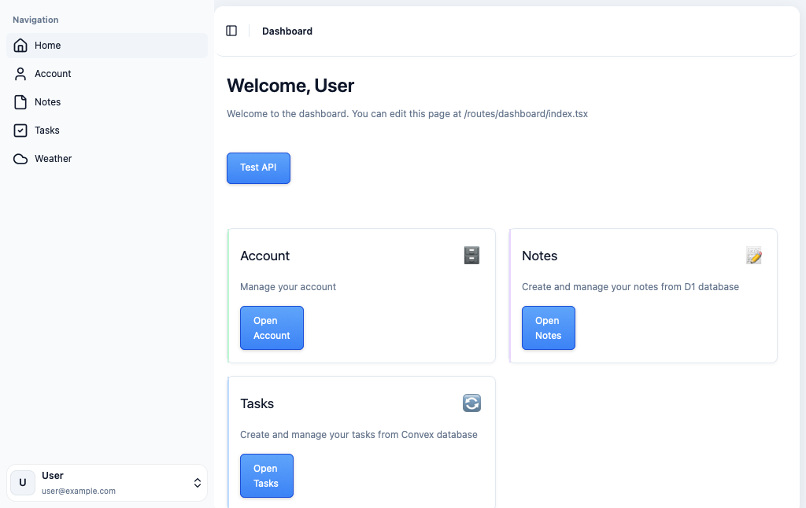
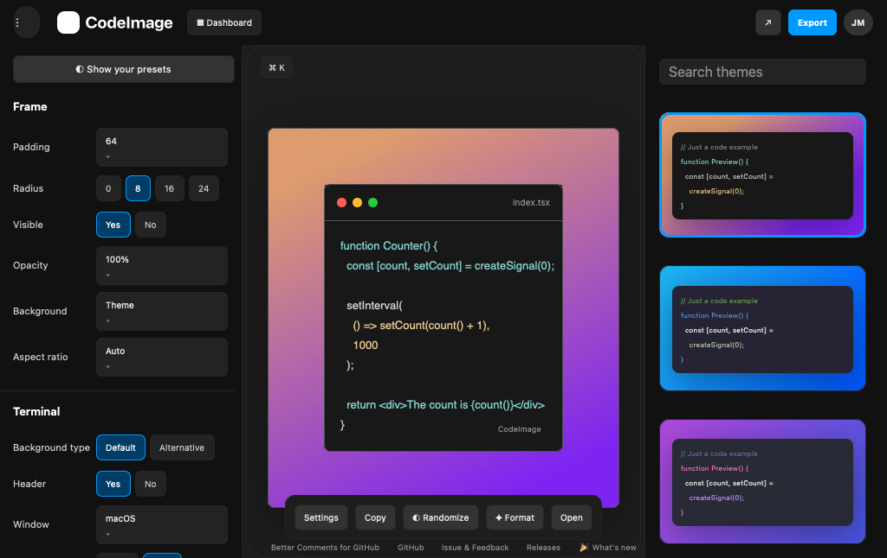
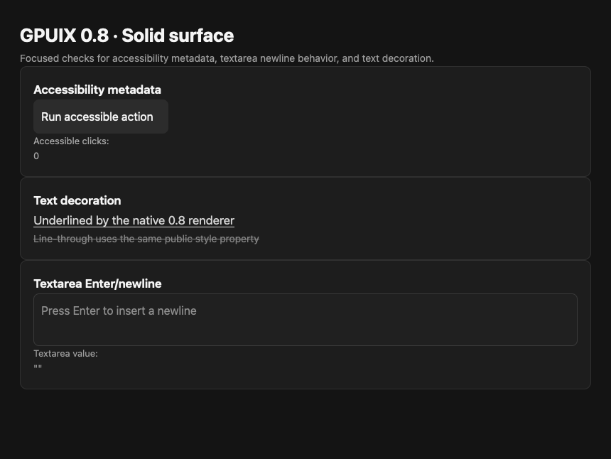
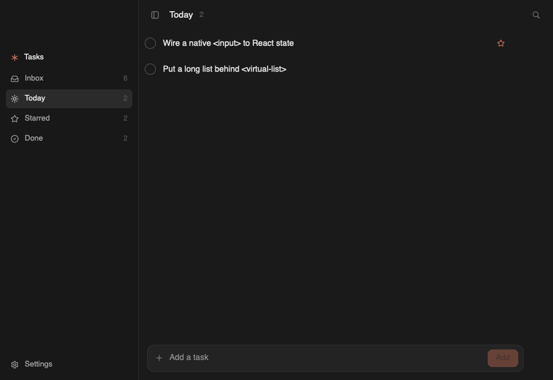

# GPUix Solid

Solid bindings for [GPUIX](https://github.com/remorses/gpuix), which targets [GPUI](https://github.com/zed-industries/zed/tree/main/crates/gpui), Zed's GPU UI framework.

Build native desktop interfaces with Solid and TypeScript. Solid JSX compiles through a universal renderer into GPUIX's retained native tree, and GPUI paints the window through the platform GPU stack. There is no Electron renderer and no web view.

```text
Solid 2 + TypeScript
        |
        v
   gpuix-solid
Solid universal renderer
        |
        v
  @gpuix/native 0.8
        |
        v
       GPUI
        |
        v
Metal / Vulkan / DirectX
```

**Current prerelease channel:** `gpuix-solid@beta`, targeting `@gpuix/native ^0.8.0`.

## Start an app

The fastest path is the copyable public-package starter in [`templates/solid2-vite-bun`](./templates/solid2-vite-bun). It intentionally lives outside the repository workspaces and installs from npm just like a new application.

```bash
cp -R templates/solid2-vite-bun my-gpuix-app
cd my-gpuix-app
bun install
bun run typecheck
bun run build
bun run start
```

For a blank project instead, install the runtime and build dependencies directly:

```bash
bun add gpuix-solid@beta solid-js@2.0.0-rc.1
bun add -d @solidjs/vite-plugin@3.0.0-next.29 vite@8.1.5 typescript@5.9.2
```

Then follow **[Build a native Solid 2 app](./docs/getting-started.md)** for the exact TypeScript/Vite setup, build/run flow, native-addon boundary, platform notes, packaging guidance, and debugging.

A minimal app looks like this:

```tsx
import { render } from "gpuix-solid"
import { createSignal } from "solid-js"

function App() {
  const [count, setCount] = createSignal(0)

  return (
    <div
      style={{
        width: "100%",
        height: "100%",
        padding: 32,
        gap: 16,
        flexDirection: "column",
        backgroundColor: "#151515",
      }}
    >
      <text style={{ color: "#f7f7f7", fontSize: 28 }}>
        GPUix Solid
      </text>

      <text style={{ color: "#f7f7f7" }}>Count: {count()}</text>

      <div
        role="button"
        aria-label="Increment counter"
        tabIndex={0}
        onClick={() => setCount((value) => value + 1)}
        style={{
          width: 160,
          padding: 12,
          borderRadius: 8,
          cursor: "pointer",
          backgroundColor: "#2b2b2b",
          hover: { backgroundColor: "#383838" },
        }}
      >
        <text style={{ color: "#f7f7f7" }}>Increment</text>
      </div>
    </div>
  )
}

render(() => <App />, {
  title: "My GPUix app",
  width: 720,
  height: 480,
})
```

Native `<text>` nodes should receive an explicit `color`. GPUix Solid accepts browser-shaped JSX, but GPUI is not a browser CSS engine and unsupported browser behavior should not be assumed.

## Why the Vite config says `browser`

A native GPUix process still needs Solid's live client reactive runtime. Solid's SSR export is designed for one-shot server rendering, so the build resolves Solid's `browser` condition while compiling JSX with `generate: "universal"` and `moduleName: "gpuix-solid"`.

That condition does **not** add a browser or DOM. It only selects Solid's live reactivity. `gpuix-solid`, `@solidjs/universal`, and `solid-js` are bundled into the app entry; `@gpuix/native` stays external so Bun can load the platform native addon normally.

The starter and clean-package smoke tests use the same configuration.

## Real application examples

These are native retained-tree captures generated from the Solid examples with GPUIX's `TestGpuixRenderer`. They are not browser mockups or screenshots borrowed from the upstream React examples.

| Dashboard | CodeImage |
| --- | --- |
|  |  |
| **GPUIX 0.8 surface** | **Todo** |
|  |  |

The repository dogfoods the renderer with app-shaped Solid UIs rather than only tiny host fixtures. Run the examples from the repository root after `bun install`.

| Example | Run | What it exercises |
| --- | --- | --- |
| [GPUIX 0.8 surface](./examples/counter/src/gpuix-08) | `bun run example:gpuix-08` | accessibility metadata, focus/tab metadata, native textarea newline behavior, text decoration |
| [Dashboard](./examples/counter/src/dashboard) | `bun run example:dashboard` | multi-route app structure, auth/router/network compatibility, dialogs, lists, controlled input |
| [CodeImage](./examples/counter/src/codeimage) | `bun run example:codeimage` | editor-style controls, native layout, source-pinned Solid application composition |
| [DAW](./examples/solid1-daw) | `bun run example:solid1-daw` | transport, tracks, ruler, mixer/effects, Tailwind classes, native adapters |
| [Chat](./examples/counter/src/chat) | `bun run example:chat` | virtualized message history, safe-MDX composition, menus, composer input, scrolling |
| [Infinite Chat](./examples/counter/src/infinite-chat) | `bun run example:infinite-chat` | bidirectional virtual history, cache/anchor restoration, navigation |
| [Timeline](./examples/counter/src/timeline) | `bun run example:timeline` | pan/zoom, clip move/trim, snapping, scrubbing, marquee selection, pointer capture |
| [Todo](./examples/counter/src/todo) | `bun run example:todo` | native input, lists, sidebar motion, icons, hover controls, virtual-list anchoring |
| [Diff](./examples/counter/src/diff) | `bun run example:diff` | unified/split diffs, Shiki highlighting, multi-hunk rendering, scrolling |
| [Mail](./examples/counter/src/mail) | `bun run example:mail` | source-first mail shell and current source-edge application coverage |
| [Blurred Window](./examples/counter/src/blurred-window.tsx) | `bun run example:blurred-window` | native window blur/glass behavior |
| [Native Text](./examples/counter/src/native-text.tsx) | `bun run example:native-text` | native markdown/code/diff elements, tabs, selection, links |
| [Counter](./examples/counter/src/index.tsx) | `bun run example:counter` | smallest signal/click/hover/update fixture |

Solid 1 compatibility is also exercised through Kobalte, Tailwind v4, the DAW, and the blurred-window example. See **[examples/README.md](./examples/README.md)** for the full matrix and source-fidelity notes.

The gallery can be regenerated from the repository with `bun run --filter 'gpuix-solid-counter' capture:readme-gallery` on a platform whose `@gpuix/native` build includes `TestGpuixRenderer`.

## GPUIX 0.8 baseline

The current prerelease line moves both Solid renderer lines and the runnable consumers to the published GPUIX 0.8 native contract.

The Solid host already exposes and validates useful 0.8-facing surface such as:

- `role` and supported `aria-*` metadata on native host nodes
- focus/tab metadata used by source-compatible controls
- `textDecoration` in the public style type, with native painted-output validation
- the current GPUIX 0.8 native event/window/runtime contract through `@gpuix/native`

Other upstream 0.8 additions are being promoted into focused Solid examples only after the Solid types/host mapping and runnable behavior are proven. That audit includes textarea newline/submission behavior, remote HTTP images, native file drop, updated Select/asChild behavior, focus traversal, and platform-specific window additions.

See **[docs/compatibility.md](./docs/compatibility.md)** for the exact dependency/platform contract and **[docs/upstream-parity.md](./docs/upstream-parity.md)** for the source-parity audit.

## Foreground-input release-candidate gate

There is one unresolved native-risk discrepancy before stable promotion. Source inspection of published `@gpuix/native@0.8.0` still shows the text-selection mouse-up ownership path that previously reproduced a fatal nested `GpuixView` update. But a fresh external consumer using the actual published `gpuix-solid@0.1.0-beta.7` + `@gpuix/native@0.8.0` packages passed real macOS paint, hover, repeated clicks, and text-selection drag/release without a panic.

Rather than claim either result proves too much, GPUix Solid carries that history forward as a release-candidate gate. The repository includes `scripts/test-published-foreground.mjs`, which installs the requested registry version outside the monorepo, typechecks/builds the original Counter reproducer and a second GPUIX 0.8 accessibility/textarea/text-decoration surface, then launches both for real foreground acceptance.

For the current prerelease channel:

```bash
GPUIX_SOLID_VERSION=beta node scripts/test-published-foreground.mjs all
```

For a specific release candidate, set `GPUIX_SOLID_VERSION` to that exact version. Stable promotion requires both foreground apps to paint, interact, select/type text, and close normally without a native panic or `GpuixView already being updated` output.

## What the renderer does

Solid compiles JSX against a custom universal runtime instead of the browser DOM.

```text
Solid signal update
        |
        v
Solid computation
        |
        v
JS host-node update
        |
        v
batched native mutations
        |
        v
@gpuix/native applyBatch
        |
        v
Rust retained tree
        |
        v
GPUI frame
```

The JavaScript host tree keeps the synchronous parent/child/sibling information Solid needs while reconciling arrays and conditional children. Accepted host mutations are serialized and applied to GPUIX's retained Rust tree in batches. Solid updates do not pass through React or `react-reconciler`.

Native animation targets, layout, and painting then stay on the GPUI side.

## Packages

### `gpuix-solid`

The Solid 2 renderer. It exports the renderer/JSX runtime, native host/components, animation API, test renderer helpers, window geometry hooks, text-search helpers, and `gpuix-solid/automation`.

### `@jhomra21/gpuix-solid1`

The Solid 1.9 compatibility renderer in `packages/solid1`. It also provides the browser-shaped compatibility entry points used by Kobalte and other browser-oriented Solid 1 source while visible output still renders through GPUIX.

### `@gpuix/native`

Published by upstream [remorses/gpuix](https://github.com/remorses/gpuix). GPUix Solid consumes that native package rather than carrying a Rust fork.

There is no first-party GPUix Solid CLI or installer generator yet.

## Testing and automation

`TestGpuixRenderer` drives the same retained native tree used by normal applications. Tests can inspect tree state, dispatch native input, read layout bounds and virtual-list anchors, inspect text highlights, control the native animation clock, and capture screenshots.

The Solid 2 package also exports a Playwright-like automation surface:

```ts
import { createTestApp } from "gpuix-solid/automation"
import { createTestRoot } from "gpuix-solid"

const testRoot = createTestRoot()
const app = createTestApp(testRoot.renderer)

await app.getByTestId("save").click()
await app.getByTestId("name").fill("New name")
await app.getByTestId("clip").dragBy(120, 0, { steps: 8 })
await app.getByTestId("history").wheel(0, 240)
```

Repository CI verifies macOS, Ubuntu, Windows, Solid 1 consumers, exact package tarballs, and an exact pinned GPUIX 0.8 source build/link/compatibility lane. The copyable starter has its own external-copy build check so it cannot pass only because of monorepo resolution.

## Source-first examples

Where an example comes from an upstream application, copied source is pinned to audited revisions and hash checked. Framework/router/network/browser substitutions belong behind compatibility boundaries rather than rewriting the application into a lookalike.

That source-provenance work is intentionally separate from the normal user path. Contributors working on source-edge compatibility should start with:

- [UPSTREAM.md](./UPSTREAM.md)
- [docs/upstream-parity.md](./docs/upstream-parity.md)
- [docs/gpuix-edge.md](./docs/gpuix-edge.md)
- [ARCHITECTURE.md](./ARCHITECTURE.md)

## Current scope

GPUix Solid currently targets GPUIX's native desktop renderer. It does not wrap GPUIX's browser/WebGPU WebAssembly renderer.

The repository's continuously validated native package matrix is macOS arm64, Linux x64 GNU, and Windows x64 MSVC. Platform-specific GPUI window behavior can still differ across operating systems.

## Documentation

- **[Build a native Solid 2 app](./docs/getting-started.md)**
- **[Copyable starter](./templates/solid2-vite-bun)**
- **[Examples](./examples/README.md)**
- **[Compatibility](./docs/compatibility.md)**
- **[Upstream parity](./docs/upstream-parity.md)**
- **[Source-edge workflow](./docs/gpuix-edge.md)**
- **[Architecture](./ARCHITECTURE.md)**
- **[Releasing](./RELEASING.md)**

## License

MIT. See [LICENSE](./LICENSE) and [THIRD_PARTY_NOTICES.md](./THIRD_PARTY_NOTICES.md) for upstream/source-attribution details.
