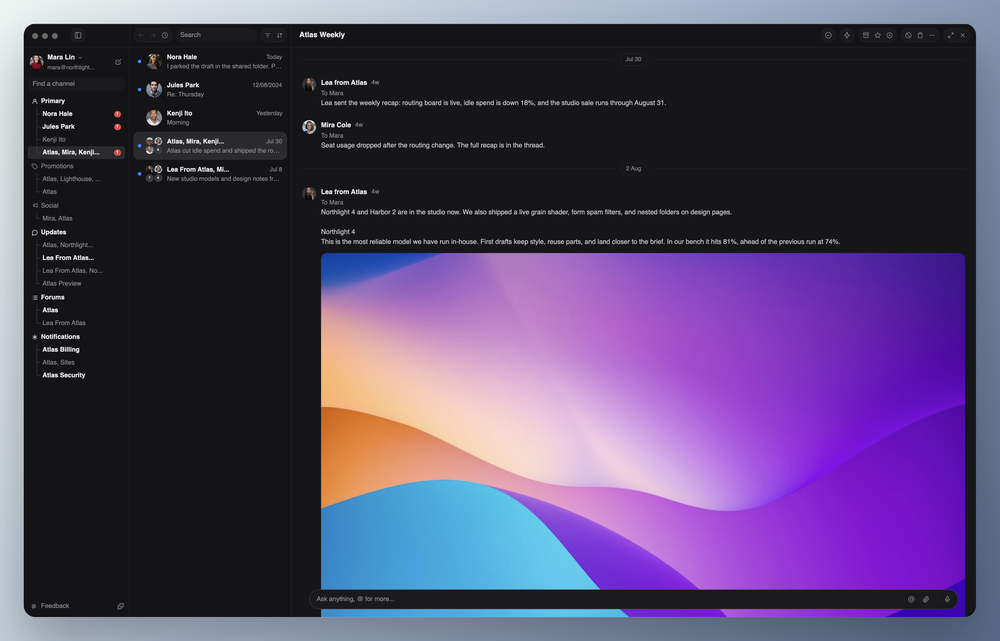

# GPUix Solid

**Solid** for [GPUIX](https://github.com/remorses/gpuix), which renders through [GPUI](https://github.com/zed-industries/zed/tree/main/crates/gpui), Zed's GPU UI framework.

Write Solid components in TypeScript. GPUix Solid turns the Solid tree into GPUIX native elements and GPUI paints the window with Metal, DirectX, or Vulkan. There is no Electron renderer and no browser web view.



The Mail example above is GPUix Solid: the sidebar, thread list, reading pane, and native composer, rendered through GPUIX and GPUI.

GPUix Solid supports two Solid generations through separate packages:

| Solid version | Package | Peer range |
| --- | --- | --- |
| Solid 2 | `gpuix-solid` | `solid-js ^2.0.0-rc.8` |
| Solid 1 | `@jhomra21/gpuix-solid1` | `solid-js >=1.9.0 <2` |

Both packages target the exact `@gpuix/native@0.9.0` contract. `gpuix-solid@0.2.0` is the current stable npm `latest`; prereleases advance on the npm `beta` dist-tag after exact-package qualification. Solid 2 uses the paired `solid-js@2.0.0-rc.8` and `@solidjs/universal@2.0.0-rc.8` runtime baseline. Solid 1 keeps its own package version and release cycle.

## Quickstart

### Solid 2

The copyable starter installs public npm packages and lives outside the repository workspaces:

```bash
cp -R templates/solid2-vite-bun my-gpuix-app
cd my-gpuix-app
bun install
bun run typecheck
bun run build
bun run start
```

To start from an empty project instead:

```bash
bun add gpuix-solid solid-js@2.0.0-rc.8
bun add -d @solidjs/vite-plugin@3.0.0-next.29 vite@8.1.5 typescript@5.9.2
```

### Solid 1

Solid 1 applications use the separate renderer package:

```bash
bun add @jhomra21/gpuix-solid1 solid-js@1.9.15
bun add -d vite-plugin-solid vite typescript
```

See [Build a native Solid 1 app](./docs/getting-started-solid1.md) for the Solid 1 compiler and runtime configuration.

## Build a Solid 2 app from scratch

### 1. Point TypeScript at GPUix Solid JSX

`jsxImportSource` must point at `gpuix-solid` so TypeScript uses the native JSX types instead of browser DOM types.

```json
{
  "compilerOptions": {
    "target": "ES2022",
    "module": "ESNext",
    "moduleResolution": "Bundler",
    "jsx": "preserve",
    "jsxImportSource": "gpuix-solid",
    "strict": true,
    "skipLibCheck": true,
    "noEmit": true
  }
}
```

### 2. Compile through Solid's universal renderer

> [!NOTE]
> `gpuix-solid/vite` is part of the repository's next prerelease. Until that version is published, the stable `^0.2.0` starter keeps the equivalent explicit Vite configuration.

```ts
import { gpuixSolid } from "gpuix-solid/vite"
import { defineConfig } from "vite"

export default defineConfig({
  plugins: [gpuixSolid()],
  build: {
    target: "node22",
    ssr: "src/index.tsx",
    outDir: "dist",
  },
})
```

`gpuixSolid()` configures Solid's universal JSX transform, selects the live `browser` runtime, keeps the Solid runtime bundled, and leaves `@gpuix/native` external. The application still owns its entry point, output directory, and build target. GPUix Solid also verifies at startup that Solid is actually reactive and reports a targeted configuration error instead of silently rendering one frozen frame.

### 3. Write the app

```tsx
import { createSignal } from "solid-js"
import { render } from "gpuix-solid"

function App() {
  const [count, setCount] = createSignal(0)

  return (
    <div
      style={{
        width: "100%",
        height: "100%",
        padding: 24,
        gap: 12,
        flexDirection: "column",
        backgroundColor: "#1a1a1a",
      }}
    >
      <text style={{ color: "#f5f5f5", fontSize: 24 }}>GPUix Solid</text>
      <text style={{ color: "#d4d4d4" }}>Count: {count()}</text>
      <div
        role="button"
        aria-label="Increment counter"
        tabIndex={0}
        onClick={() => setCount((value) => value + 1)}
        style={{
          width: 160,
          padding: 12,
          borderRadius: 8,
          cursor: "pointer",
          backgroundColor: "#292929",
          hover: { backgroundColor: "#383838" },
        }}
      >
        <text style={{ color: "#f5f5f5" }}>Increment</text>
      </div>
    </div>
  )
}

render(() => <App />, {
  title: "My GPUix app",
  width: 800,
  height: 600,
})
```

> [!IMPORTANT]
> Give native `<text>` nodes an explicit `color`. GPUI does not inherit text color from a parent the way browser CSS does, so an omitted color can paint black text on a dark surface.

### 4. Build and run

```bash
bun run typecheck
bun run build
bun run start
```

The maintained starter uses Vite to produce `dist/index.js`, then Bun runs that file with `@gpuix/native` loaded as the platform-specific native addon. The current `dev` script rebuilds and restarts the app. GPUix Solid does not currently provide the same window-preserving hot reload command as upstream GPUIX React.

For the complete Solid 2 setup and the equivalent explicit Vite configuration, see [Build a native Solid 2 app](./docs/getting-started.md). User-facing API references live in the [documentation index](./docs/README.md).

## Solid-native primitives

Stateful Solid helpers use `create*` names. `createWindowSize()`, `createWindowInsets()`, `createTextSearch()`, and `createTextSelection()` allocate reactive state or subscriptions under the current Solid owner and clean up with that owner. The older `useWindowSize`, `useWindowInsets`, and `useTextSearch` exports remain as deprecated compatibility aliases for existing applications.

Context accessors such as `useGpuix()` keep `use*` naming because they read an existing context rather than creating reactive ownership.

## Examples

The repository includes source-pinned GPUIX ports and larger native application fixtures. Visible output renders through GPUIX.

| Example | Solid version | Run | What it exercises |
| --- | --- | --- | --- |
| Mail | 2 | `bun run example:mail` | three-pane mail UI, HTTP images, navigation, reader modes, text selection |
| Chat | 2 | `bun run example:chat` | virtualized history, menus, composer input, selection, scrolling, Markdown/MDX |
| Timeline | 2 | `bun run example:timeline` | pan and zoom, clip editing, snapping, pointer capture |
| Todo | 2 | `bun run example:todo` | native input, virtual lists, hover controls, sidebar motion |
| GPUIX 0.9 surface | 2 | `bun run example:gpuix-surface` | accessibility metadata, textarea input, text decoration, reactive window selection |
| Dashboard | 2 | `bun run example:dashboard` | routes, controlled input, lists, dialogs, scrolling |
| CodeImage | 2 | `bun run example:codeimage` | editor layout, controls, themes, native compatibility |
| Kobalte | 1 | `bun run example:solid1-kobalte` | portals, dialogs, menus, focus, keyboard input |
| Tailwind v4 | 1 | `bun run example:solid1-tailwind` | compiled native styles, theme tokens, hover and active states |
| DAW | 1 | `bun run example:solid1-daw` | tracks, ruler, transport, mixer, effects, native adapters |

See [examples/README.md](./examples/README.md) for the complete matrix and source references.

## How rendering works

Both renderers compile Solid JSX through a custom universal renderer into GPUIX's retained native tree.

```text
Solid signal update
        |
        v
Solid computation
        |
        v
JavaScript host-node update
        |
        v
batched native mutations
        |
        v
@gpuix/native applyBatch
        |
        v
Rust retained tree
        |
        v
GPUI frame
```

Solid 1 and Solid 2 use different framework runtimes, but they share the framework-neutral native host contract where possible. CI checks that shared host code for drift.

## GPUIX 0.9 baseline

Both renderer packages consume the exact published GPUIX 0.9 native contract. GPUIX 0.9 adds window-level selection-change events and includes the upstream native click/selection ownership fix; GPUix Solid exposes the event at the root boundary and as the Solid-native `createTextSelection()` primitive.

The maintained Solid paths test accessibility metadata, focus and tab metadata, text decoration, controlled text input, pointer input, native images, and the event and window behavior used by the current examples.

An upstream GPUIX feature is not treated as supported by GPUix Solid until the Solid host or compatibility layer exposes it and a runnable check proves the path. See [compatibility.md](./docs/compatibility.md) and [upstream-parity.md](./docs/upstream-parity.md).

## Packages

### `gpuix-solid`

The Solid 2 renderer. It exports the renderer and JSX runtime, native host components, animation helpers, test renderer helpers, Solid-native window/text primitives, and `gpuix-solid/automation`.

### `@jhomra21/gpuix-solid1`

The Solid 1 renderer. It keeps the Solid 1 runtime boundary separate and includes the tested `./web` compatibility entry used by browser-oriented Solid 1 source such as Kobalte.

### `@gpuix/native`

The upstream GPUIX native package. GPUix Solid consumes it rather than carrying a Rust fork.

## JSX-free authoring

For runtime-authored UI that does not pass through the Solid JSX compiler, GPUix Solid now exposes a small hyperscript helper:

```ts
import { h, render } from "gpuix-solid"

render(() =>
  h(
    "div",
    {
      class: () => active() ? "flex px-4 bg-blue-500" : "flex px-2 bg-zinc-900",
    },
    () => active() ? "Active" : "Idle",
  )
)
```

`h()` uses the same universal renderer paths as JSX. Event handlers stay ordinary function props, while common data/style props and function-valued children can stay reactive. `makeH()` returns an isolated helper with the same behavior.

## Solid 2 styling conveniences

Without a generated native style manifest, Solid 2 can compile a deliberately small Tailwind-compatible utility subset directly into GPUIX styles:

```tsx
<div class="flex items-center gap-2 px-3 py-2 bg-zinc-900 text-white rounded-md hover:bg-zinc-800">
  <text style={{ color: "#fff" }}>Native utility classes</text>
</div>
```

Supported utilities cover common flex layout, spacing, sizing, colors, typography, radius, opacity, cursors, and `hover:` / `active:` states. Unsupported tokens fail instead of being silently ignored. If `configureNativeStyleManifest()` is present, that generated manifest remains authoritative.

Inline styles also accept the layout shorthands `paddingX`, `paddingY`, `marginX`, `marginY`, `size`, `inset`, `insetX`, and `insetY`; GPUix Solid expands them to GPUIX's physical style keys before native delivery. Explicit physical keys win when both are provided.

## Desktop integration

GPUix Solid exposes OS-facing helpers for native desktop applications:

```ts
import { appMenu, appWindow, dialog, list, render, shell } from "gpuix-solid"

const files = await dialog.openFile({ multiple: true })
const destination = await dialog.saveFile({ suggestedName: "project.json" })
await shell.revealPath("/tmp/project.json")
await shell.openWithSystem("https://github.com/remorses/gpuix")

const app = render(() => <App />, {
  title: "My App",
  ...appMenu.default("My App"),
})

appWindow.setTitle(app.renderer, "Renamed window")
appWindow.activate(app.renderer)

// For a <virtual-list ref={listRef}> where listRef.id is the native element id:
list.scrollToItem(app.renderer, listRef.id, 200)
```

On macOS, dialogs use the system dialog service and shell actions use `open`; Windows uses the platform PowerShell/Explorer integrations; Linux uses `zenity` for dialogs and `xdg-open` for shell actions. `appWindow` exposes the imperative window capabilities GPUIX 0.9 actually provides (`setTitle` and `activate`), while `list` wraps its retained-list scrolling methods. GPUIX 0.9 already owns the native macOS App + Window menus; `appMenu.default()` supplies its application label. Arbitrary custom native menu items and imperative minimize/zoom/fullscreen commands are not exposed by the GPUIX 0.9 native contract.

Finder/OS file drops are native GPUI events:

```tsx
<div onFileDrop={(event) => openFiles(event.paths ?? [])}>
  <text>Drop files here</text>
</div>
```

The native test renderer and locator API can drive the same path with `locator.dropFiles([...])`.

Internal application drag/drop uses GPUIX pointer hit testing while the Solid host owns the semantic payload:

```tsx
<div
  dragData={{ id: "clip-1" }}
  onDragStart={onStart}
  onDragEnd={onEnd}
>
  <text>Drag me</text>
</div>
<div onDragOver={onDragOver} onDrop={(event) => moveClip(event.dragData)}>
  <text>Drop here</text>
</div>
```

A four-pixel movement threshold separates a drag from a click, and completing a drag suppresses the source click for that release. Once the threshold is crossed, GPUix Solid clones the dragged host subtree into a translucent pointer-following overlay, preserving the original grab point and the source element's measured size, styles, text, and nested visual children. Draggable sources default to `userSelect: "none"` so semantic dragging does not start native text selection; an explicitly authored `userSelect` still wins.

Run the complete local showcase with `bun run example:desktop`.

## Testing

Repository CI validates macOS, Ubuntu, Windows, the Solid 1 package and consumers, the Solid 2 package tarball, source-pinned examples, and the exact GPUIX 0.9 source compatibility lane. The Solid 2 package and clean consumers run against the paired `solid-js@2.0.0-rc.8` and `@solidjs/universal@2.0.0-rc.8` baseline.

The Solid 2 package also exports Playwright-like native automation:

```ts
import { createTestApp } from "gpuix-solid/automation"
import { createTestRoot } from "gpuix-solid"

const testRoot = createTestRoot()
const app = createTestApp(testRoot.renderer)

await app.getByTestId("save").click()
await app.getByTestId("name").fill("New name")
await app.getByTestId("clip").dragBy(120, 0, { steps: 8 })
await app.getByTestId("history").wheel(0, 240)
```

The published `0.2.1-beta.0` package passed clean external-consumer build and live interaction checks. A post-beta candidate then fixed production `createTextSelection()` subscription forwarding; live-native automation proved selection, clear, reselection, and a follow-up action on that exact candidate. A literal physical mouse/trackpad drag on the current GPUIX 0.9 line remains unverified because CUA could not attach to the Bun-launched native window. See [release-candidate.md](./docs/release-candidate.md) for the current and historical qualification records.

## Source-pinned application work

Where an example comes from upstream source, the repository records exact source revisions and hashes. Framework, router, network, browser, and package differences belong in compatibility code rather than application rewrites.

Contributors working on source compatibility should read:

- [Upstream baseline](./docs/upstream.md)
- [Upstream parity](./docs/upstream-parity.md)
- [Source-edge workflow](./docs/gpuix-edge.md)
- [Architecture](./docs/architecture.md)

## Current scope

GPUix Solid targets GPUIX's native desktop renderer. It does not wrap GPUIX's browser or WebGPU WebAssembly renderer.

The continuously validated native package matrix is macOS arm64, Linux x64 GNU, and Windows x64 MSVC. Platform-specific GPUI window behavior can differ across operating systems.

GPUix Solid does not currently ship the upstream `@gpuix/cli`, Hermes runtime path, shell completions, application packaging flow, auto-update integration, or browser renderer as Solid-specific supported workflows. Those upstream features should only be documented here after the Solid path is implemented and tested.

There is no first-party GPUix Solid application installer or packaging CLI yet.

## Repository layout

GPUix Solid keeps ownership explicit rather than accumulating framework, fixture, tooling, and release concerns at the repository root:

- `packages/` owns the separately versioned Solid renderers;
- `examples/` owns runnable native fixtures and source-pinned application dogfood;
- `templates/` owns copyable public starters;
- `scripts/` owns repository tooling and acceptance harnesses;
- `tools/` owns maintained repository tooling that is packaged or configured as source, including the custom oxlint anti-slop plugin;
- `experiments/` is limited to the legacy Solid 1 compatibility lab; new maintained runnable coverage belongs in `examples/` or its owning package;
- `docs/` owns repository-wide architecture, compatibility, qualification, and release contracts;
- `.github/` owns CI and release automation.

Package-specific documentation stays with its package. Repository-wide docs belong under `docs/`. See the [documentation index](./docs/README.md) for the ownership map.

## Documentation

- [Documentation index](./docs/README.md)
- [Solid 2 getting started](./docs/getting-started.md)
- [Solid 1 getting started](./docs/getting-started-solid1.md)
- [Solid 2 starter](./templates/solid2-vite-bun)
- [Examples](./examples/README.md)
- [Compatibility](./docs/compatibility.md)
- [Release qualification](./docs/release-candidate.md)
- [Upstream parity](./docs/upstream-parity.md)
- [solid-gpui parity notes](./docs/solid-gpui-parity.md)
- [Source-edge workflow](./docs/gpuix-edge.md)
- [Architecture](./docs/architecture.md)
- [Performance](./docs/performance.md)
- [Releasing](./docs/releasing.md)

## License

MIT. See [LICENSE](./LICENSE) and [THIRD_PARTY_NOTICES.md](./THIRD_PARTY_NOTICES.md) for source attribution.
